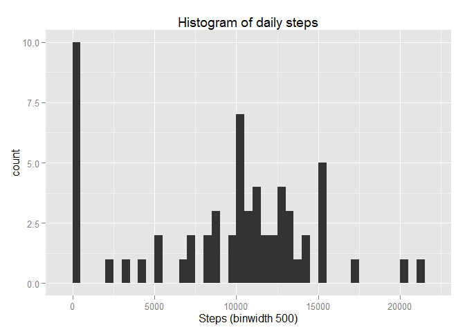
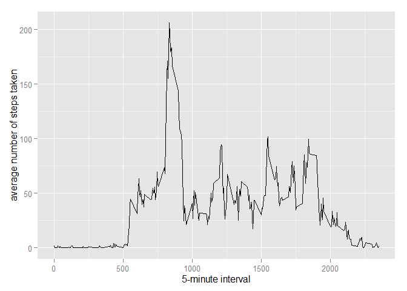
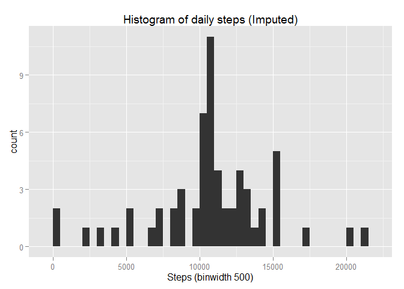
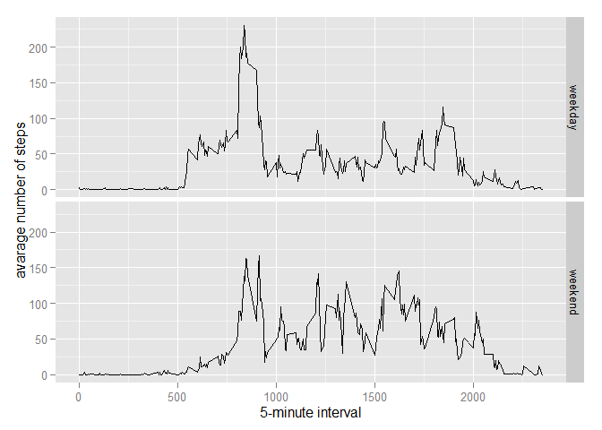

# Reproducible Research: Peer Assessment 1


## Loading and preprocessing the data
##### 1. Load the data (i.e. read.csv())

```r
if(!file.exists('activity.csv')){
    unzip('activity.zip')
}
activityData <- read.csv('activity.csv')
```

##### 2. Process/transform the data (if necessary) into a format suitable for your analysis

```r
activityData$date <- as.Date(activityData$date)
```

-----

## What is mean total number of steps taken per day?
##### 1. Calculate the total number of steps taken per day

```r
stepsByDay <- aggregate(x = activityData$steps , by = list(activityData$date), FUN = sum ,na.rm=TRUE)
```
##### 2. Make a histogram of the total number of steps taken each day

```r
library(ggplot2)
```

```
## Warning: package 'ggplot2' was built under R version 3.1.3
```

```r
names(stepsByDay) <- c("date","steps")
ggplot(stepsByDay,aes(x = steps)) +
            ggtitle("Histogram of daily steps") +
            xlab("Steps (binwidth 500)") +
            geom_histogram(binwidth = 500)
```

 

##### 3. Calculate and report the mean and median total number of steps taken per day

* Calculate the mean of the total number of steps taken per day

```r
mean(stepsByDay$steps, na.rm=TRUE)
```

```
## [1] 9354.23
```

* Calculate the median of the total number of steps taken per day

```r
median(stepsByDay$steps, na.rm=TRUE)
```

```
## [1] 10395
```

-----

## What is the average daily activity pattern?

```r
averageStepsPerTimeBlock <- aggregate(x=list(meanSteps=activityData$steps), by=list(interval=activityData$interval), FUN=mean, na.rm=TRUE)
```

##### 1. Make a time series plot

```r
ggplot(data=averageStepsPerTimeBlock, aes(x=interval, y=meanSteps)) +
    geom_line() +
    xlab("5-minute interval") +
    ylab("average number of steps taken") 
```

 

##### 2. Which 5-minute interval, on average across all the days in the dataset, contains the maximum number of steps?

```r
mostSteps <- which.max(averageStepsPerTimeBlock$meanSteps)
gsub("([0-9]{1,2})([0-9]{2})", "\\1:\\2", averageStepsPerTimeBlock[mostSteps,'interval'])
```

```
## [1] "8:35"
```
----

## Imputing missing values
##### 1. Calculate and report the total number of missing values in the dataset 

```r
length(which(is.na(activityData$steps)))
```

```
## [1] 2304
```


##### 2. Devise a strategy for filling in all of the missing values in the dataset.
* Impute missing step values with mean step at time interval


##### 3.Create a new dataset that is equal to the original dataset but with the missing data filled in.

```r
activityDataImputed<-merge(x=activityData, y=averageStepsPerTimeBlock, by="interval", all.x=TRUE)
activityDataImputed[is.na(activityDataImputed$steps),c("steps")]<-activityDataImputed[is.na(activityDataImputed$steps),c("meanSteps")]
```

##### 4. Make a histogram of the total number of steps taken each day 

```r
stepsByDayImputed <- aggregate(x = activityDataImputed$steps , by = list(activityDataImputed$date), FUN = sum ,na.rm=TRUE)
names(stepsByDayImputed)<-c("date", "steps")
ggplot(stepsByDayImputed,aes(x = steps)) +
            ggtitle("Histogram of daily steps (Imputed)") +
            xlab("Steps (binwidth 500)") +
            geom_histogram(binwidth = 500)
```

 

##### 5. Calculate and report the mean and median total number of steps taken per day. 
*Calculate the mean

```r
stepsByDayMeanImputed <- mean(stepsByDayImputed)
```

```
## Warning in mean.default(stepsByDayImputed): argument is not numeric or
## logical: returning NA
```
* Calculate the median

```r
stepsByDayMeanImputed <- mean(stepsByDayImputed)
```

```
## Warning in mean.default(stepsByDayImputed): argument is not numeric or
## logical: returning NA
```
----

## Are there differences in activity patterns between weekdays and weekends?
##### 1. Create a new factor variable in the dataset with two levels - "weekday" and "weekend" indicating whether a given date is a weekday or weekend day.


```r
activityDataImputed$dateType <-  ifelse(as.POSIXlt(activityDataImputed$date)$wday %in% c(0,6), 'weekend', 'weekday')
```

##### 2. Make a panel plot containing a time series plot


```r
averagedActivityDataImputed <- aggregate(steps ~ interval + dateType, data=activityDataImputed, mean)
ggplot(averagedActivityDataImputed, aes(interval, steps)) + 
    geom_line() + 
    facet_grid(dateType ~ .) +
    xlab("5-minute interval") + 
    ylab("avarage number of steps")
```

 

